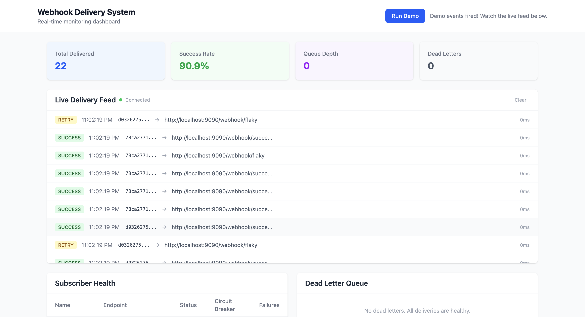
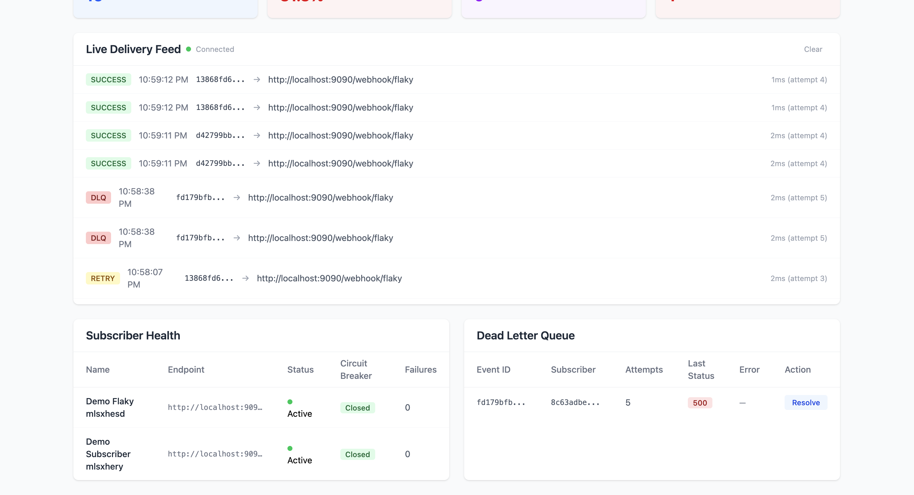

# Webhook Delivery System

A fault-tolerant webhook delivery platform built in Go that reliably delivers event notifications to subscriber endpoints. Implements industry-standard reliability patterns — the same infrastructure behind Stripe, GitHub, and Shopify's webhook systems.





## Features

- **Event Fan-out** — Publish an event, automatically deliver to all matching subscribers
- **Guaranteed Delivery** — At-least-once delivery with exponential backoff retries (5 attempts)
- **Circuit Breaker** — Per-endpoint circuit breakers prevent flooding broken services (closed → open → half-open → closed)
- **Rate Limiting** — Per-subscriber sliding window rate limiter using atomic Redis Lua scripts
- **Dead Letter Queue** — Failed deliveries after max retries are captured for manual review and replay
- **HMAC Signatures** — Every delivery signed with HMAC-SHA256 so receivers can verify authenticity
- **Worker Pool** — Goroutine-based concurrent delivery engine with configurable pool size
- **Real-time Dashboard** — React + Tailwind dashboard with live WebSocket feed, metrics cards, subscriber health table, and DLQ management
- **Graceful Shutdown** — Workers finish in-flight deliveries before the server stops

## Architecture

```
              ┌─────────────────────────────────────────────┐
              │        Dashboard (React + Tailwind)          │
              │                                              │
              │   Metrics  │  Live Feed  │  Health  │  DLQ   │
              └──────────────────┬──────────────────────────┘
                                 │ WebSocket + HTTP
┌────────────────────────────────▼──────────────────────────────┐
│                    API Server (Go + Chi)                       │
│                                                               │
│  POST /events → Fan-out Engine → Find matching subscribers    │
│                                → Queue delivery jobs in Redis │
└──────┬────────────────────────────────────┬───────────────────┘
       │                                    │
┌──────▼─────────────┐          ┌───────────▼───────────────┐
│    PostgreSQL      │          │          Redis             │
│                    │          │                            │
│  Subscribers       │          │  Delivery Queue            │
│  Events            │          │  (sorted set)              │
│  Delivery Logs     │          │                            │
│  Dead Letters      │          │  Circuit Breaker           │
│                    │          │  (per-subscriber)          │
└────────────────────┘          │                            │
                                │  Rate Limiter              │
                                │  (sliding window)          │
                                └─────────────┬─────────────┘
                                              │
                    ┌─────────────────────────▼──────────────────────────┐
                    │            Worker Pool (Goroutines)                │
                    │                                                    │
                    │  Dispatcher polls Redis every 100ms                │
                    │       ↓                                            │
                    │  Buffered Go channel (job queue)                   │
                    │       ↓                                            │
                    │  N worker goroutines                               │
                    │       ↓                                            │
                    │  HTTP POST with HMAC signature                     │
                    │       ↓                                            │
                    │  Success → record + broadcast to WS                │
                    │  Failure → retry with backoff or → DLQ             │
                    └────────────────────────────────────────────────────┘
```

## Tech Stack

| Component | Technology | Why |
|-----------|-----------|-----|
| API Server | Go + Chi | Lightweight router built on `net/http`, goroutines for concurrency |
| Database | PostgreSQL + pgx | ACID guarantees, JSONB payloads, fastest pure-Go Postgres driver |
| Queue & Cache | Redis | Sorted sets for priority queue, Lua scripts for atomic rate limiting |
| Workers | Goroutines + Channels | Native concurrency — thousands of workers in minimal memory |
| Dashboard | React + Tailwind CSS | Real-time WebSocket feed with Vite build |
| Infrastructure | Docker Compose | One-command setup for all services |
| CI | GitHub Actions | Automated build, test, vet, and lint on every push |

## Quick Start

### Prerequisites

- Go 1.22+
- PostgreSQL 14+
- Redis 7+
- Node.js 20+ (for dashboard)

### Option 1: Docker Compose

```bash
docker compose up
```

This starts PostgreSQL, Redis, and the API server. Dashboard available at `http://localhost:8080`.

### Option 2: Run Locally

```bash
# Start PostgreSQL and Redis
brew services start postgresql
brew services start redis

# Create the database
createdb webhook

# Set environment variables
export DATABASE_URL="postgresql://$(whoami)@localhost:5432/webhook?sslmode=disable"
export REDIS_URL="redis://localhost:6379"

# Start the API server (migrations run automatically)
go run ./cmd/server

# In a new terminal — start mock endpoints for testing
go run ./mock-endpoints

# In a new terminal — start the dashboard
cd dashboard && npm install && npm run dev
```

Open `http://localhost:3000` for the dashboard.

## Demo

Click the **"Run Demo"** button in the dashboard to see the system in action:

1. It creates test subscribers pointing to success and flaky mock endpoints
2. Fires 3 events that fan out to all matching subscribers
3. Watch the **Live Feed** show deliveries streaming in real-time
4. Green = success, yellow = retrying, red = moved to dead letter queue
5. Metrics cards update every 2 seconds
6. Subscriber health table shows circuit breaker states

You can also fire events manually:

```bash
# Create a subscriber
curl -s -X POST http://localhost:8080/api/v1/subscribers \
  -H "Content-Type: application/json" \
  -d '{
    "name": "My App",
    "endpoint_url": "http://localhost:9090/webhook/success",
    "event_types": ["order.created"]
  }'

# Publish an event
curl -s -X POST http://localhost:8080/api/v1/events \
  -H "Content-Type: application/json" \
  -d '{
    "event_type": "order.created",
    "payload": {"order_id": "ORD-001", "amount": 42.00}
  }'

# Check delivery status
curl -s http://localhost:8080/api/v1/deliveries | python3 -m json.tool

# Check system metrics
curl -s http://localhost:8080/api/v1/metrics | python3 -m json.tool
```

## API Reference

### Subscribers

| Method | Endpoint | Description |
|--------|----------|-------------|
| POST | `/api/v1/subscribers` | Register a new subscriber |
| GET | `/api/v1/subscribers` | List all subscribers |
| GET | `/api/v1/subscribers/{id}` | Get subscriber with subscriptions |
| PATCH | `/api/v1/subscribers/{id}` | Update subscriber (name, active, rate limit) |
| GET | `/api/v1/subscribers/{id}/health` | Circuit breaker state for subscriber |

### Events

| Method | Endpoint | Description |
|--------|----------|-------------|
| POST | `/api/v1/events` | Publish an event (triggers fan-out + delivery) |
| GET | `/api/v1/events` | List events (filter: `event_type`, `limit`) |
| GET | `/api/v1/events/{id}` | Get event details |

### Deliveries

| Method | Endpoint | Description |
|--------|----------|-------------|
| GET | `/api/v1/deliveries` | List delivery attempts (filter: `event_id`, `subscriber_id`, `status`) |
| GET | `/api/v1/deliveries/{id}` | Get single delivery attempt |

### Dead Letter Queue

| Method | Endpoint | Description |
|--------|----------|-------------|
| GET | `/api/v1/dead-letters` | List failed deliveries (filter: `subscriber_id`, `resolved`) |
| GET | `/api/v1/dead-letters/{id}` | Get dead letter details |
| POST | `/api/v1/dead-letters/{id}/resolve` | Mark as resolved |

### Dashboard & Monitoring

| Method | Endpoint | Description |
|--------|----------|-------------|
| GET | `/api/v1/health` | Health check |
| GET | `/api/v1/metrics` | Aggregated delivery statistics |
| GET | `/api/v1/subscribers-health` | All subscribers with circuit breaker states |
| GET | `/ws` | WebSocket for real-time delivery events |

## Reliability Patterns

### Retry Strategy
Failed deliveries retry with exponential backoff plus jitter:

| Attempt | Base Delay | With Jitter |
|---------|-----------|-------------|
| 1 | Immediate | Immediate |
| 2 | 2s | 2s + 0-1s random |
| 3 | 4s | 4s + 0-1s random |
| 4 | 8s | 8s + 0-1s random |
| 5 | 16s | 16s + 0-1s random |

After 5 failed attempts → moved to dead letter queue.

### Circuit Breaker
Per-subscriber state machine stored in Redis:

```
Closed (normal) ──5 failures──→ Open (blocking)
                                    │
                              30s cooldown
                                    │
                               Half-Open
                              (test 1 request)
                              /            \
                         success          failure
                            ↓                ↓
                         Closed            Open
```

### Rate Limiting
Sliding window algorithm implemented as a Redis Lua script for atomicity. Each subscriber can configure their own `rate_limit_per_second`.

## Testing

```bash
# Run all tests with race detector
go test -race -v ./internal/...

# Run with coverage
go test -coverprofile=coverage.out ./internal/...
go tool cover -func=coverage.out
```

**26 tests** covering:
- Circuit breaker state transitions (9 tests)
- Rate limiter sliding window (4 tests)
- HMAC signature verification (4 tests)
- HTTP delivery integration with httptest (4 tests)
- WebSocket hub broadcasting (4 tests)

All tests use `miniredis` (in-memory Redis) so no external services are needed.

## Project Structure

```
webhook-delivery-system/
├── cmd/server/              # Application entry point
├── internal/
│   ├── api/                 # HTTP handlers and routing
│   │   ├── router.go        # Chi router with middleware + CORS
│   │   ├── events.go        # Event creation and listing
│   │   ├── subscribers.go   # Subscriber CRUD + health
│   │   ├── deliveries.go    # Delivery attempt logs
│   │   ├── dead_letters.go  # Dead letter queue management
│   │   ├── dashboard.go     # Metrics + subscriber health API
│   │   ├── health.go        # Health check
│   │   └── response.go      # JSON response helpers
│   ├── config/              # Environment variable loader
│   ├── domain/              # Domain models (Event, Subscriber, etc.)
│   ├── engine/
│   │   ├── fanout.go        # Event → subscriber matching → Redis queue
│   │   ├── circuitbreaker.go # Per-subscriber circuit breaker (Redis)
│   │   └── ratelimiter.go   # Sliding window rate limiter (Redis Lua)
│   ├── store/
│   │   ├── postgres.go      # Connection pool + migration runner
│   │   ├── redis.go         # Redis client wrapper
│   │   ├── subscriber_store.go
│   │   ├── event_store.go
│   │   ├── delivery_store.go
│   │   └── metrics_store.go # Aggregated delivery statistics
│   ├── websocket/
│   │   └── hub.go           # WebSocket hub for real-time dashboard
│   └── worker/
│       ├── pool.go          # Goroutine worker pool
│       ├── dispatcher.go    # Redis → channel dispatcher
│       └── deliverer.go     # HTTP delivery with signatures + retries
├── migrations/              # Versioned SQL files (up + down)
├── mock-endpoints/          # Configurable test endpoints (success/fail/slow/flaky)
├── dashboard/               # React + Tailwind frontend (Vite)
│   ├── src/components/      # MetricsCards, LiveFeed, SubscriberHealth, DLQ
│   └── src/hooks/           # useWebSocket, useMetrics, useApi
├── .github/workflows/       # CI pipeline (Go test + dashboard build)
├── docker-compose.yml       # PostgreSQL + Redis + API
└── Dockerfile               # Multi-stage build
```

## Environment Variables

| Variable | Default | Description |
|----------|---------|-------------|
| `PORT` | `8080` | API server port |
| `DATABASE_URL` | — (required) | PostgreSQL connection string |
| `REDIS_URL` | — (required) | Redis connection string |
| `NUM_WORKERS` | `50` | Number of delivery worker goroutines |

## Database Schema

Five tables with proper indexing:

| Table | Purpose |
|-------|---------|
| `subscribers` | Webhook endpoints with secret keys and rate limits |
| `events` | Published events with JSONB payloads |
| `subscriptions` | Maps subscribers to event type patterns |
| `delivery_attempts` | Every delivery try with status, timing, response body |
| `dead_letter_queue` | Permanently failed deliveries for manual review |

## Author

**Priya More** — [GitHub](https://github.com/Priya8975)

## License

MIT
